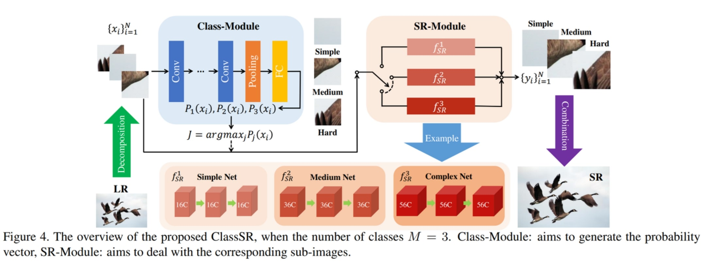

# Camera_quality_improvement
##  카메라 이미지 품질 향상 AI 경진대회

 

빛 번짐을 해결하여 카메라 이미지 품질을 향상시키는 것이 본 프로젝트의 목표이다.
우리는 주어진 문제를 해결하기 위하여 CVPR 2021 논문 [ClassSR : A General Framework to Accelerate Super-Resolution Networks by Data Characteristic](https://github.com/Xiangtaokong/ClassSR) 의 ClassSR 모델을 차용한다.

 

영상의 해상도가 높아짐에 따라 이를 처리하기 위한 연산 비용은 이차적으로 증가한다.
우리는 주어진 FHD, UHD와 같은 큰 이미지에 대한 **SR 네트워크를 ClassSR 모델을 통하여 가속화**한다.
이는 입력 이미지에 대한 sub-image를 분류하는 **Class-Module**과 각 class마다 다르게 적용되는 **SR-Module**을 통해 이루어진다.

 

